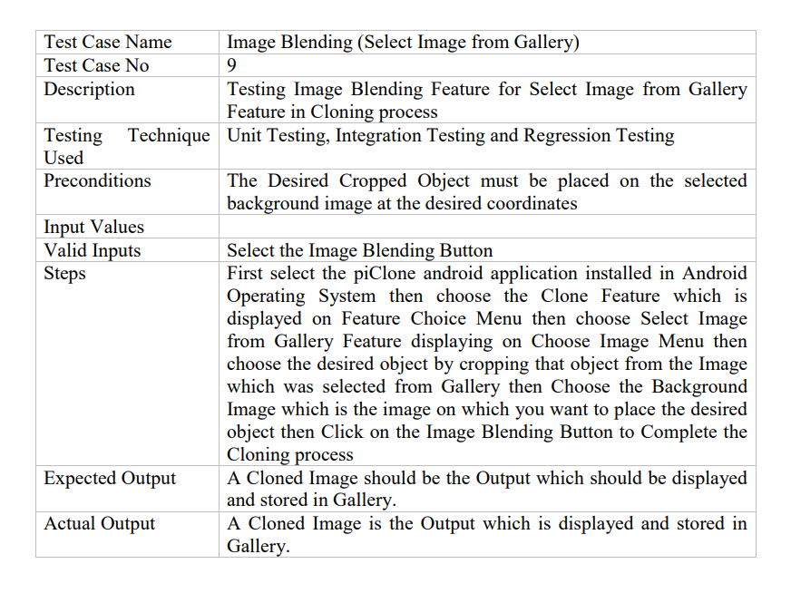

# Pi-clone
 Image Editing App

This Application is aimed to provide a platform for the end user to edit images on 
an Android device.

It takes in two pictures from the user. One picture can be selected as the base 
picture or as the background. By identifying and recognizing objects, via manual 
cropping, the desired object can be extracted from the image and then be stitched 
on top of Background image of the user’s choosing.

The contours would be recognized by the help of some of the following different 
well proven techniques, such as Edge and Corner Detection, The Canny Edge 
Detector, The Sobel operator, Harris Corner Detection and others like Hough 
transformations. To improve the primary or the secondary images, our system will 
provide the user the ability to apply different filters to the images, including basic 
filters such as Mean Blur, Gaussian Blur, Median Blur, Sharpener, Dilation, 
Erosion and different Threshold filters such as Binary Threshold and Threshold to 
Zero filters. To make the editing and cloning of a selection region seamless we 
will make use of Poisson partial differential equation with Dirichlet boundary 
conditions which specifies the Laplacian of an unknown function over the domain 
of interest, along with the unknown function values over the boundary of the 
domain. The extent of the changes ranges from slight distortions to complete 
replacement by novel content.

The purpose of this app is to give the end user easy access to various image editing 
and image extraction techniques with the help of an easy to use graphic user 
interface and minimal learning effort. Using this app the end user can create 
amazing breathtaking pictures which can then be saved to local storage or can then 
be shared among friends using the social media.

# Test-Case Example
For more details please check Chapter 5- Testing and Evaluation in Final-FYP-Thesis.pdf

